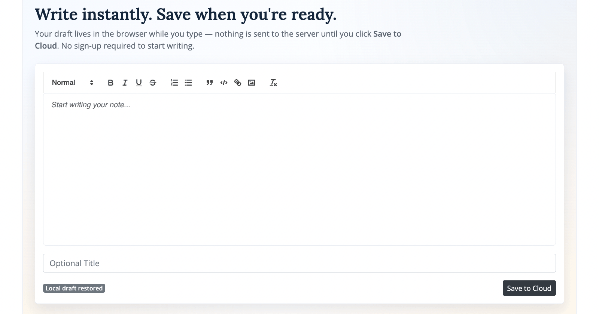

# Notebase
**Write instantly. Save when you're ready. Chat with your knowledge base.**




Notebase is a Laravel-based productivity tool that combines a no-login rich-text notepad with a personal knowledge workspace. Save notes to the cloud, organize them into notebooks, attach sources, and query your content through an AI chat interface with cited responses.

---

## Features

### ✏️ Instant Notepad
- Rich-text editor (Quill) with autosave — no sign-up required to start writing
- Save to cloud with one click once you're ready
- Namespaced note URLs: `/n/{slug}`
- Optional password protection on any note (hashed at rest)
- Owner-aware edit permissions with read-only fallback for visitors

### 📓 Notebooks & Organization
- Create notebooks with visibility controls: `private`, `unlisted`, `public`
- Share-token links for unlisted and public notebooks
- Attach sources to notebooks — existing notes, uploaded files (`pdf`, `doc`, `docx`), or URLs
- Manage sources with status filtering (`pending`, `processing`, `ready`, `failed`) and retry support

### 🔍 Source Ingestion Pipeline
- Background ingestion jobs with status tracking
- URL extraction with HTML cleanup
- File extraction with format-specific strategies
- Extracted text persisted for retrieval

### 🤖 AI Chat with Citations
- Notebook-scoped semantic RAG retrieval
- Chat UI with full conversation history and memory summarization
- Cited assistant responses linked to source chunks
- Token usage tracking per conversation
- OpenAI-backed generation and embeddings when configured; deterministic local fallback otherwise

### 🔐 Authentication
- Social login only — Google and GitHub OAuth via Laravel Socialite
- No passwords, no email verification, no registration forms

---

## Tech Stack

| Layer           | Technology                                    |
| --------------- | --------------------------------------------- |
| Backend         | PHP 8.2+, Laravel 12                          |
| Frontend        | Bootstrap 4.6.2, jQuery 3.7.1, Quill 2.0.3    |
| Auth            | Laravel Socialite (Google, GitHub)            |
| AI / Embeddings | OpenAI API (optional)                         |
| Queue           | Laravel Queue (`database` driver recommended) |
| Database        | MySQL / PostgreSQL / SQLite                   |

---

## Quick Start

```bash
composer install
npm install && npm run dev

cp .env.example .env
php artisan key:generate
php artisan migrate
```

### Environment Variables

```env
APP_URL=http://localhost:8000

# Database
DB_CONNECTION=mysql
DB_DATABASE=notebase
DB_USERNAME=root
DB_PASSWORD=

# Queue (required for source ingestion)
QUEUE_CONNECTION=database

# Social Auth — Google
GOOGLE_CLIENT_ID=
GOOGLE_CLIENT_SECRET=
GOOGLE_REDIRECT_URI="${APP_URL}/callback/google"

# Social Auth — GitHub
GITHUB_CLIENT_ID=
GITHUB_CLIENT_SECRET=
GITHUB_REDIRECT_URI="${APP_URL}/callback/github"

# AI — optional, local fallback used when absent
OPENAI_API_KEY=
OPENAI_EMBEDDING_MODEL=text-embedding-3-small
OPENAI_CHAT_MODEL=gpt-4o-mini
```

### Run

```bash
# Web server
php artisan serve

# Background worker — required for source ingestion
php artisan queue:work
```

> If the jobs table is missing: `php artisan queue:table && php artisan migrate`

---

## RAG Configuration

Fine-tune retrieval behaviour in `.env`:

```env
RAG_MIN_RETRIEVAL_SCORE=0.08
RAG_SEMANTIC_WEIGHT=0.75
RAG_KEYWORD_WEIGHT=0.25
RAG_RECENT_MESSAGES_WINDOW=6
RAG_SUMMARY_CHAR_LIMIT=1200
```

---

## Testing

```bash
vendor/bin/phpunit
```

Useful route checks:

```bash
php artisan route:list --path=n
php artisan route:list --path=notebooks
php artisan route:list --path=chat
```

---

## Documentation

Full technical documentation — architecture, data model, ingestion pipeline internals, chat flow, route map, security model, and roadmap:

→ [`PROJECT_DOCUMENTATION.md`](PROJECT_DOCUMENTATION.md)

---

## License

MIT
